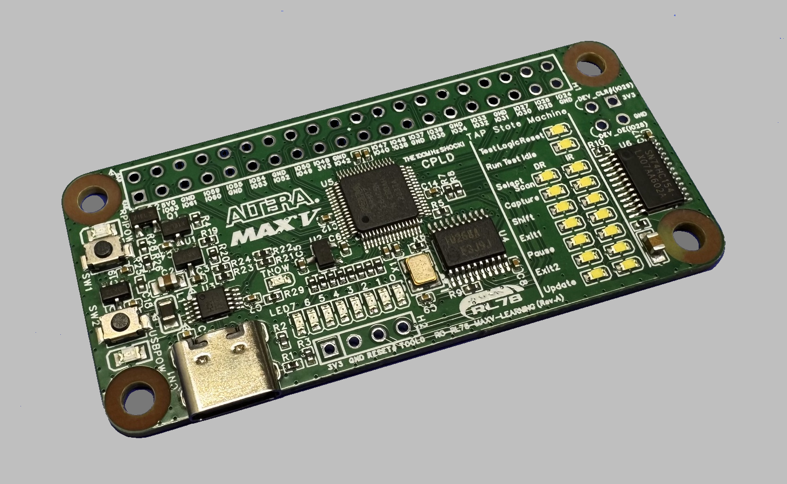
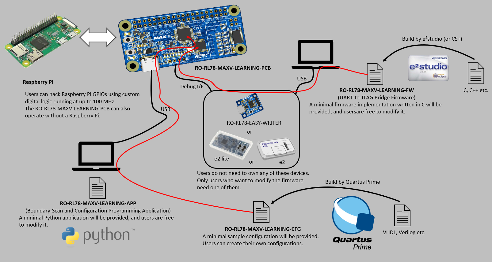
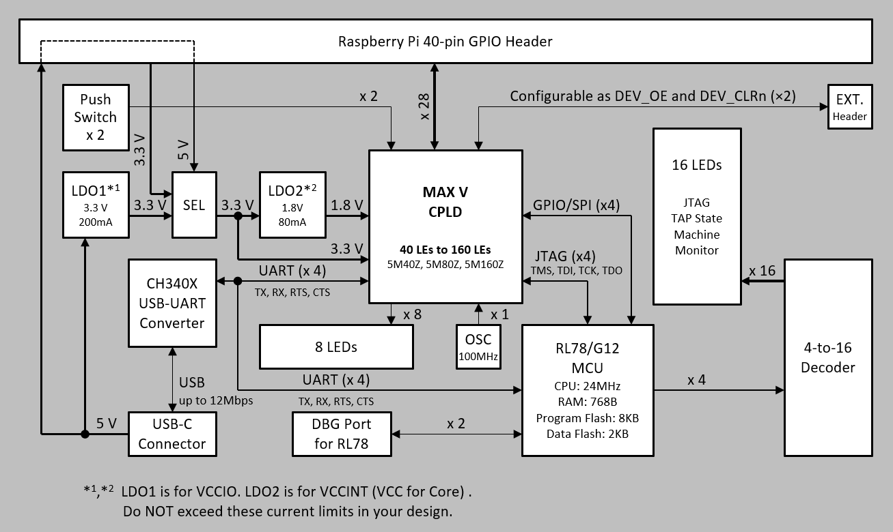
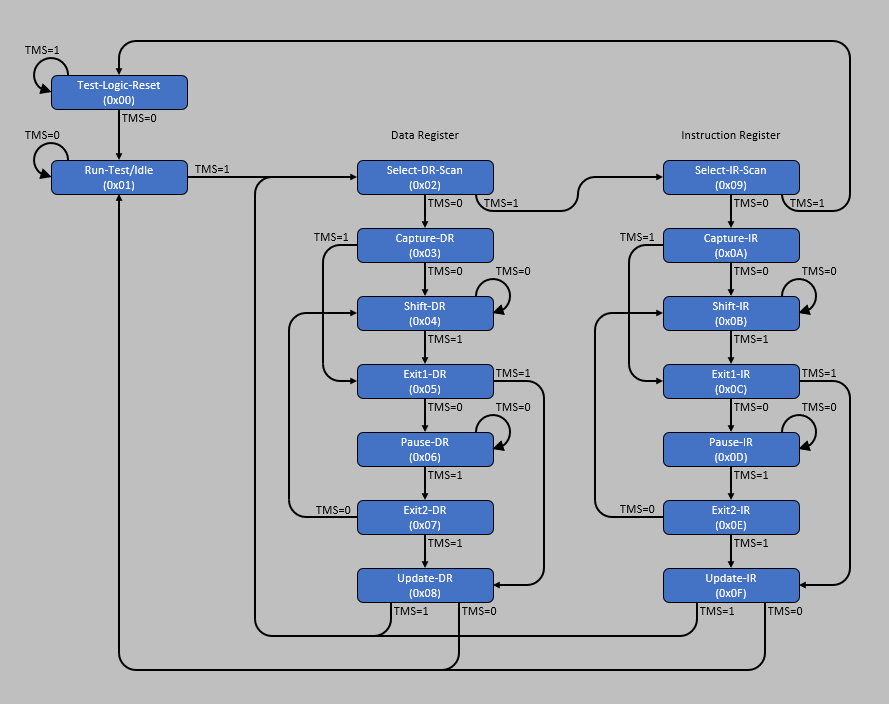

# ro-rl78-maxv-learning
A learning board for JTAG and digital circuits, featuring a Raspberry Pi-compatible 40-pin GPIO header, with firmware and host software included.

**Note**: The Rev. A PCB arrived, and of course it had a bug 😇 See [Rev.B(in progress)](#schematic) of the schematic.

---

## System Overview
With this board, you can learn:
- How to control JTAG without any vendor software
- How to design digital circuits from scratch

Many engineers can use JTAG, but few understand how it works. With this board and the provided software, you can learn to control it without any vendor tools. You can also learn digital circuit design. FPGAs are great for large circuits but a bit complicated, so starting with a CPLD is good for beginners.

---

## Block Diagram
The whole board runs from a single USB-C cable. LDO1 makes 3.3 V for the I/O, LDO2 derives 1.8 V for the MAX V core. At the center, the MAX V CPLD connects to the Raspberry Pi 40-pin header, a 100 MHz oscillator, and the RL78/G12 MCU via JTAG; the RL78 turns UART commands from the PC (through the CH340X) into JTAG signals. The 16 LEDs act as a live [TAP Controller](#tap-controller) monitor, so you can watch the TAP states change as JTAG runs.

---

## TAP Controller
The TAP Controller is a 16-state machine defined by IEEE 1149.1 that sequences all JTAG operations. The LEDs silkscreened "TAP State Machine" on the board show these 16 states in real time, so you can watch the controller move through them as you drive JTAG from the PC or the MCU.

---

## Project Documents
Documents written for this project and included in the repository.

---

### RO-RL78-MAXV-LEARNING-PCB

#### BOM
[Rev.A](pcb/bom/ro-rl78-maxv-learning-pcb-bom_Rev_A.pdf)

#### Schematic
[Rev.A](pcb/schematic/ro-rl78-maxv-learning-pcb-sch_Rev_A.pdf)
[Rev.B(in progress)](pcb/schematic/ro-rl78-maxv-learning-pcb-sch_Rev_B.pdf)

#### Board
[Rev.A](pcb/board/ro-rl78-maxv-learning-pcb-brd_Rev_A.pdf)

---

### RO-RL78-MAXV-LEARNING-FW
There are two types of firmware for the MCU (RL78) in this project:
(The linked file is available for now)
- [PCJ (RO_RL78_MAXV_LEARNING_FW_PCJ.zip)](fw/RO_RL78_MAXV_LEARNING_FW_PCJ.zip) = PC-controlled JTAG (PC controls TCK)
- MCJ (RO_RL78_MAXV_LEARNING_FW_MCJ.zip) = MCU-controlled JTAG (MCU controls TCK)

PCJ is for understanding JTAG itself. The PC drives every TCK edge by hand.  MCJ is for learning digital circuits. The RL78 writes to the CPLD as a JTAG master.  The firmware is built with e2studio. If you want to modify it, you need to install e2studio first.

---

### RO-RL78-MAXV-LEARNING-APP
Three applications will be provided for PCJ, and one for MCJ. All of them are written in Python. Files that are linked are ready; the others are not yet available.

#### APP for PCJ
- [pcj_get_idcode.py](app/pcj_get_idcode.py) : reads the IDCODE of the CPLD
- pcj_get_pins.py   : gets the pin states of the CPLD
- pcj_set_pins.py   : sets the pin states of the CPLD

#### APP for MCJ
- mcj_write_cpld.py : writes the configuration data into the CPLD

---

## Referenced Documents
External datasheets and manuals for the parts used on this board.

### CPLD
[MAX V Device Handbook](https://docs.altera.com/v/u/docs/654928/max-v-device-handbook)

### MCU
[RL78/G12 Datasheet](https://www.renesas.com/en/document/dst/rl78g12-datasheet-0?srsltid=AfmBOorB3Il6-O8VI_aK6pjBkjMe29EAkK5h5Y84IsoA7L9LItQJMVmQ)

### USB-UART Converter
[CH340X](https://docs.sparkfun.com/SparkFun_RTK_Facet_mosaic/assets/component_documentation/CH340DS1.PDF)

### LDO
[XC6206P332MR-G(3.3V), XC6206P182MR-G(1.8V)](https://www.mouser.com/datasheet/2/760/XC6206-846335.pdf)